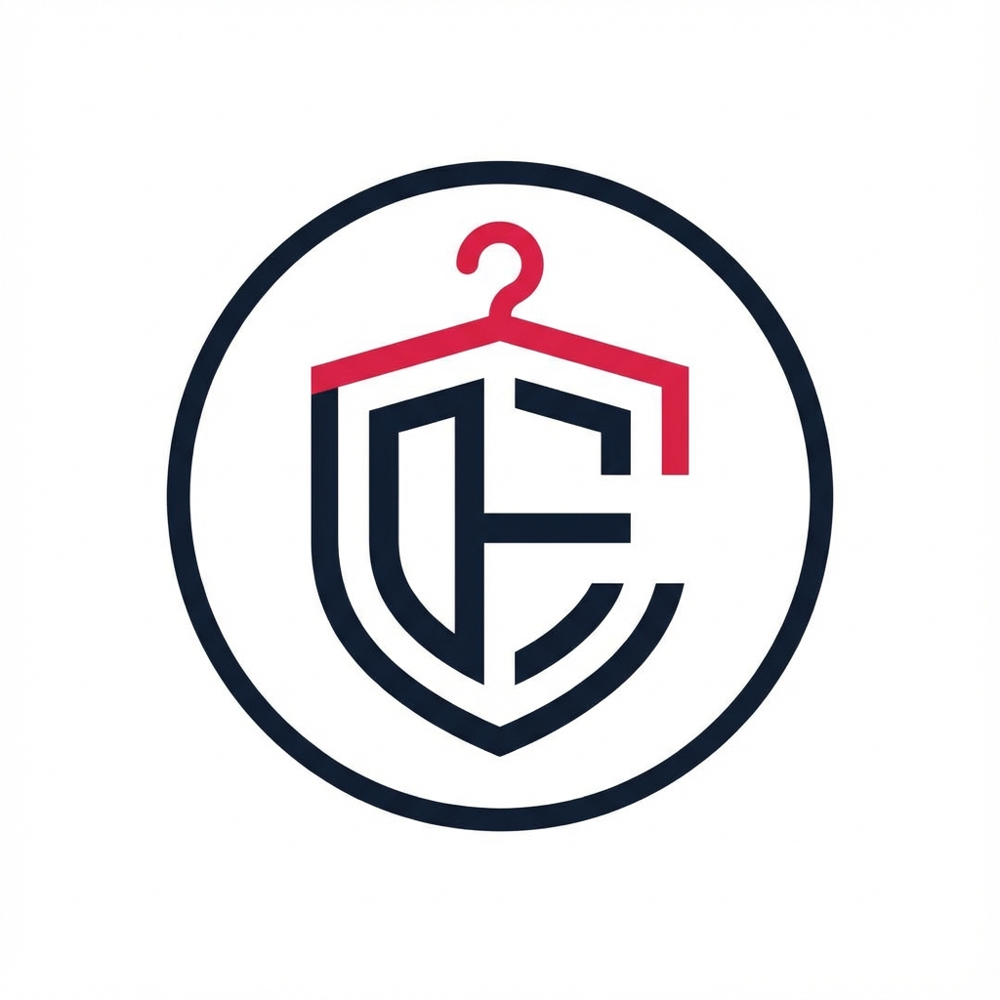

# Closet By Era

A premium fashion e-commerce website built with **Next.js 16**, **TypeScript**, **Tailwind CSS 4**, and **Supabase**.

<div align="center">
  <a href="https://closet-by-era-two.vercel.app/">
    
  </a>

  <h3 align="center">Live Demo</h3>

  <a href="https://closet-by-era-two.vercel.app/">
    
  </a>
  
  <p align="center">
    <strong>Premium Fashion • Modern Design • Seamless Shopping</strong>
  </p>
</div>

## ✨ Features

- 🛍️ **Product Catalog** - Browse products by category with filtering and sorting
- 🎨 **Modern Design** - Premium, sleek UI with smooth animations and gradients
- 📱 **Fully Responsive** - Optimized for mobile, tablet, and desktop
- 🔍 **Search** - Find products quickly with search functionality
- 💳 **Shopping Cart** - Add items, manage quantities, checkout
- ❤️ **Wishlist** - Save favorite items for later
- 👤 **User Accounts** - Register, login, order history
- 🏷️ **Sale Section** - Special discounts with percentage badges
- 📧 **Newsletter** - Email subscription for updates

## 🚀 Tech Stack

- **Framework**: Next.js 16 (App Router, Server Components)
- **Language**: TypeScript
- **Styling**: Tailwind CSS 4
- **Database**: Supabase (PostgreSQL)
- **Fonts**: Inter, Outfit (Google Fonts)
- **Deployment**: Vercel-ready

## 📁 Project Structure

```
closet-by-era/
├── src/
│   ├── app/
│   │   ├── globals.css      # Global styles
│   │   ├── layout.tsx       # Root layout with metadata
│   │   ├── page.tsx         # Homepage
│   │   ├── products/        # Products listing page
│   │   ├── women/           # Women's collection
│   │   ├── men/             # Men's collection
│   │   └── sale/            # Sale section
│   ├── components/
│   │   ├── Navbar.tsx       # Navigation bar
│   │   ├── Hero.tsx         # Hero section
│   │   ├── CategorySection.tsx
│   │   ├── ProductCard.tsx
│   │   ├── FeaturedProducts.tsx
│   │   ├── PromoSection.tsx
│   │   ├── Newsletter.tsx
│   │   └── Footer.tsx
│   └── lib/
│       └── supabase.ts      # Supabase client
├── database/
│   └── schema.sql           # Database schema & seed data
├── public/                  # Static assets
└── package.json
```

## 🛠️ Getting Started

### Prerequisites

- Node.js 18+ 
- npm or yarn
- Supabase account

### Installation

1. **Clone the repository**
   ```bash
   git clone https://github.com/yourusername/closet-by-era.git
   cd closet-by-era
   ```

2. **Install dependencies**
   ```bash
   npm install
   ```

3. **Set up environment variables**
   
   Create a `.env.local` file in the root directory:
   ```env
   NEXT_PUBLIC_SUPABASE_URL=your_supabase_url
   NEXT_PUBLIC_SUPABASE_ANON_KEY=your_supabase_anon_key
   ```

4. **Set up the database**
   
   - Go to your Supabase dashboard
   - Navigate to SQL Editor
   - Run the contents of `database/schema.sql`

5. **Run the development server**
   ```bash
   npm run dev
   ```

6. **Open in browser**
   
   Visit [http://localhost:3000](http://localhost:3000)

## 🎨 Design System

### Colors

| Color | Hex | Usage |
|-------|-----|-------|
| Rose Primary | `#e11d48` | CTAs, highlights, sale badges |
| Slate Dark | `#0f172a` | Text, dark backgrounds |
| Rose Light | `#fda4af` | Accents, gradients |

### Typography

- **Headings**: Outfit (Google Fonts)
- **Body**: Inter (Google Fonts)

### Components

- **ProductCard**: Displays product with image, name, price, badges
- **Navbar**: Fixed header with search, cart, account icons
- **Hero**: Full-screen gradient with CTA buttons
- **Footer**: Links, social icons, newsletter

## 📊 Database Schema

### Main Tables

- `products` - Product catalog
- `categories` - Product categories with hierarchy
- `customers` - User accounts
- `orders` - Order records
- `order_items` - Line items per order
- `carts` - Shopping cart items
- `wishlists` - Saved products
- `reviews` - Product reviews
- `coupons` - Discount codes
- `banners` - Promotional banners

### Views

- `popular_products` - Featured products
- `sale_products` - Products on sale with discount %
- `new_arrivals` - Latest additions

## 🔒 Security

- Row Level Security (RLS) enabled on all user data
- Public read access for products and categories
- Authenticated access required for orders and cart

## 📦 Deployment

### Vercel (Recommended)

1. Push to GitHub
2. Connect to Vercel
3. Add environment variables
4. Deploy!

```bash
npm run build
```

## 📝 Environment Variables

| Variable | Description |
|----------|-------------|
| `NEXT_PUBLIC_SUPABASE_URL` | Your Supabase project URL |
| `NEXT_PUBLIC_SUPABASE_ANON_KEY` | Supabase anonymous key |

## 🤝 Contributing

Contributions are welcome! Please read our contributing guidelines first.

## 📄 License

MIT License - see [LICENSE](LICENSE) for details.

---

Made with ❤️ by [Your Name]
